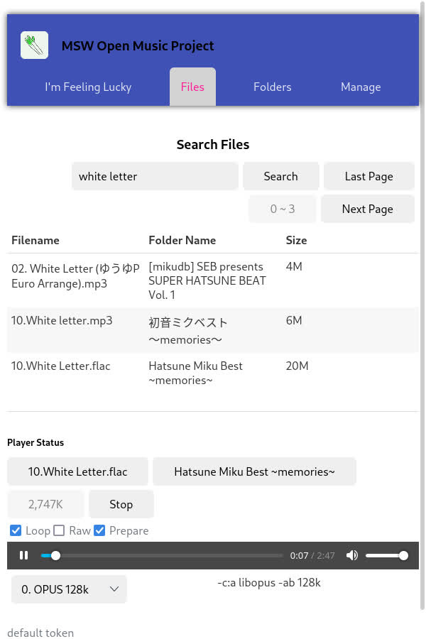

# MSW Open Music Project

A light weight personal music streaming platform.

## Introduction

This is a music streaming platform software developed to manage (index, search, tag, review)  **large amount** of music (also video) files. Also it can use `ffmpeg` to re-encode music stream so that you can enjoy your huge lossless music via slow and unstable network.

If you:

- Collect a lot of music

- Want to use a "clean" music player

- Want to stream music via network

Then this will be a good choice for you.



[TOC]

### What it can do

- Traverse the specified folder and index files whose extensions meet the requirements.

- Listening network port. Return to the front-end web page and process API requests.

- Call ffmpeg to transcode music or video.

- Manage files' information in the database, including adding tags, comments, etc.

### How it works

First, administrator run the back-end program, then setup an admin account. Then he/she can update database with a root directory and a file pattern list.

After setting up, user can enjoy music.

```sequence
Title: Flow chat
User browser->Backend server: Open web page
Backend server->User browser: font end files
User browser->Backend server: JavaScript request
Backend server->Database: SQL Query
Backend server->File system: Access file
Backend server->User browser: Return music stream
```

### What it won't do

- Modify your file.

- Read music metadata (for example, composer, album, genre).

- Detect file changes (Need to manually update the database).

## ER Diagram

Entities Relationship Diagram


- `avatar` entity may change in future rc version.

- The first time you run the program, the server will create an anonymous user with id 1. All users who are not logged in will be automatically logged in to this account.

- `tmpfs` is store in memory, which will be empty everytime server restart.

## How to build

Compile software from source code. If you use the pre-compiled version, you don’t need to do this.

### Build the back-end server

`make linux` or `make windows`

The executable file is named `msw-open-music` or `msw-open-music.exe`

### Build the font-end web pages

To build production web page `make web`

This command will go into `web` directory and install `node_modules`. Then execute `npm run build` command. The built web pages is under `web/build` directory.

To start the development, run `cd web` and `npm start`

## Usage

> Security Warning (v1.2.0-rc1):
> 
> The cookie stored in the client browser is encrypted using the environment variable "SESSION_KEY". The server will trust the client's cookie. Leaking this environment variable may cause security problems. This problem will be fixed in a future rc version.
> 
> Password is not hashed in database, which will be fixed in next rc version.

Start back-end server. Server will listen on 8080 port.

Build the font-end web page, then go to <http://127.0.0.1:8080>

By default:

- URL matched `/api/*` will process by back-end server.
- Others URL matched `/*` will be served files under `web/build/`

### Run back-end server

> Token authencation no longer support in v1.2.0 stable version.

Configuration file is  `config.json`， **Please modify your `token`** 。

Default `ffmpeg_threads` is 1. Seems value larger than 1 will not increase the audio encode speed.

#### config.json description

- `database_name` string type. The filename of `sqlite3` database. Will create if that file doesn't exist.
- `addr` string type. The listen address and port.
- `token` string type. Password.
- `ffmpeg_config_list` list type, include `ffmpegConfig` object.
- `file_life_time` integer type (second). Life time for temporary file. If the temporary file is not accessed for more than this time, back-end server will delete this file.
- `cleaner_internal` integer type (second). Interval for `tmpfs` checking temporary file.
- `root` string type. Directory to store temporary files. Default is `/tmp`, **please modify this directory if you are using Windows.**

### Run font-end web page

Open your web browser to <http://127.0.0.1:8080> you will see the web pages.

### Setup the first admin account

The first administrator account will be active automatically, other administrator accounts need active manually.

Go to register page, select the role to admin, and register the first admin account.

## About tmpfs

If the `Prepare` mode is enabled in the font-wed player, back-end server will convert the whole file into the temporary folder, then serve file using native method. This cqan avoid ffmpeg pipe break problem cause by unstable network connection while streaming audio.

The default temporary folder is `/tmp`, which is a `tmpfs` file system in Linux operating system. Default life time for temporary files is 600 seconds (10 minutes). If the temporary file is not accessed for more than this time, back-end server will delete this file.

## Change log

- `v1.0.0` First version. Ready to use in production environment.
- `v1.1.0` Use `React` to rewrite the font-end web pages (Previous using `Vue`).
- `v1.2.0` Add user, tag, review, video functions for DBMS course work.

## Back-end API references

API does not need to respond any data will return the following JSON object.

```json
{
    "status": "OK"
}
```

Sometime errors happen, server will return the following JSON object, which `error` is the detailed error message.

```json
{
    "error": "Wrong password"
}
```

API does not need to send any data should use `GET` method, otherwise use `POST` method.

Server use cookies to authencate a user. Any request without cookies will be consider from an anonymouse user.

Some import source code file:

- `pkg/api/api.go` define URL

- `pkg/database/sql_stmt.go` define SQL queries and do the init job.

- `pkg/database/struct.go` define JSON structures for database entities.

## Font-end web pages

- `/#/` Get random files.

- `/#/files` Search files.

- `/#/files/39` Information of the which id is 39.

- `/#/files/39/review` Reviews of the file with file id 39.

- `/#/files/39/share` Share page with the file id 39.

- `/#/folders` Search folders.

- `/#/folders/2614` Files in folder which id is 2614.

- `/#/manage` Manage page.

- `/#/manage/users` List users.

- `/#/manage/users/1` Information of user whose id is 1.

- `/#/manage/tags` List tags.

- `/#/manage/tags/1` Information of tag which id is 1.

- `/#/manage/feedbacks` List feedbacks.
